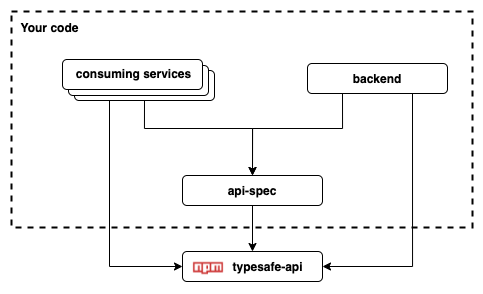

# typesafe-api

#### Motivation

Let's face it everybody loves TypeScript and everybody needs APIs. 

We have typesafe frontends and typesafe backends, why not typesafe APIs?

This library will enable you to define your API spec in pure TS, easily create an API client to 
consume it, and implement routes and handlers on the server side. 

You'll never miss a parameter in a request again!

#### Repo Architecture

The following dependency diagram show the suggested repo architecture you should use to 
define your API. 

The recommended architecture is to define your API spec in a sperate repo. Create an npm module for 
it then use it as dependency in both your backend project and any consuming services / frontends for the API. 

You could conceivably define the API spec from within the the backend and export the relevant 
objects and interfaces however this would probably make life more difficult as you would end up with 
multiple builds in the same repo (so as to avoid importing the whole project backend when you want 
to consume the api) etc.

