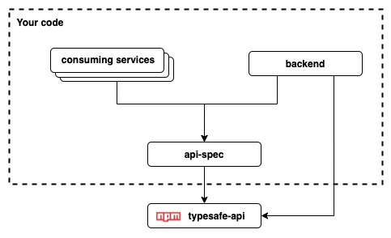

# typesafe-api

#### Motivation

Let's face it everybody loves TypeScript and everybody needs APIs. 

We have typesafe frontends and typesafe backends, why not typesafe APIs?

This library will enable you to define your API spec in pure TS, easily create an API client to 
consume it, and implement routes and handlers on the server side. 

You'll never miss a parameter in a request again!

#### Recommended Repo Architecture

The following dependency diagram show the suggested repo architecture you should use to 
define your API. 



The recommended architecture is to define your API spec in a separate repo. Create an npm module for 
it then use it as dependency in both your backend project and any consuming services / frontends for the API.

* N.B. use [npm link](https://docs.npmjs.com/cli/v7/commands/npm-link) to experiment with changes to 
your API spec before your publish to npm it will save you tones of time!

You could conceivably define the API spec from within the the backend and export the relevant 
objects and interfaces however this would probably make life more difficult as you would end up with 
multiple builds in the same repo (so as to avoid importing the whole project backend when you want 
to consume the api) etc.

## Getting started

Here is a minimal example to get you started...

### API Spec 

We are going to define an basic API with just one endpoint.

When defining an API endpoint there are two main concepts we need to think about.

1)  `EndpointDef`
    
    You need to create an custom `EndpointDef` for each endpoint in your API. This type represents
    the interface for the API endpoint e.g.
     * URL params
     * Query params, 
     * The request body 
     * Any headers that must be set
     * The expected response type
     * What error codes can be expected to be returned by the endpoint
 
2) `Route`
    
    This is an object that represents the API path and method that should be used when calling the 
    endpoint

Let's define an endpoint...
 
```typescript
import {EndpointDef, ErrorType, ReqOptions, Route} from 'typesafe-api';

// Define the route at which the endpoint belongs
export const helloWoldRoute: Route = {
  method: 'get',
  path: '/hello-world'
};

// Define the all parameters that are required to make the request
export interface HelloWorldReq extends ReqOptions {
  query: {
    yourName: string;
  }
}

// Define the response type we wil receive for the request
export interface HelloWorldResp {
  msg: string,
  date: Date,
}

// Define any error that may be thrown by the endpoint, the default is just `500`
type HelloWorldErrors = ErrorType<500|400>

// Create the endpoint definition this type encapsulates the full endpoint spec
export type HelloWorldEndpointDef = EndpointDef<HelloWorldReq, HelloWorldResp, HelloWorldErrors>
```

Now we have our route and endpoint defined we very easily create an `ApiClient` for it.

```typescript
import {createRouteRequest, ApiClientDef, apiClientBuilder} from 'typesafe-api';
import {helloWoldRoute, HelloWorldEndpointDef} from './routes';

const clientDef: ApiClientDef = {
  helloWorld: createRouteRequest<HelloWorldEndpointDef>(helloWoldRoute),
};

export const apiClient = apiClientBuilder(clientDef);
```

Great that's our API spec all sorted. Now all that remains make sure everything is exported in the 
correct and publish your spec an an npm module.  
